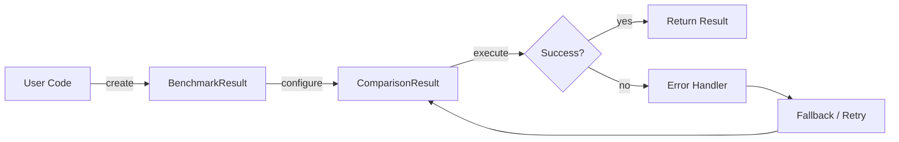
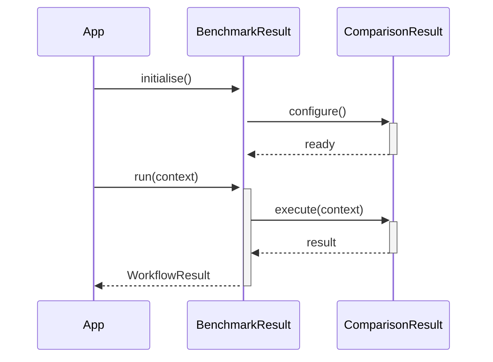

<div align="center">

</div>

# agent-benchmark

**Performance benchmarking for LLM agents — timed runs, statistical summaries, regression detection.**

[](https://pypi.org/project/agent-benchmark/) [](https://python.org) [](LICENSE) [](#)

---

## The Problem

Without benchmarks, performance regressions ship silently. A 40% latency increase between versions is invisible until it hits production. Repeatable, baseline-aware benchmarks catch regressions before users do.

## Installation

```bash
pip install agent-benchmark
```

## Quick Start

```python
from agent_benchmark import BenchmarkResult, ComparisonResult

# Initialise
instance = BenchmarkResult(name="my_agent")

# Use
result = instance.run()
print(result)
```

## API Reference

### `BenchmarkResult`

```python
class BenchmarkResult:
    name: str
    def is_faster_than(self, other: "BenchmarkResult") -> bool:
        """Return True if this result has a lower mean than *other*."""
    def regression_vs(self, baseline: "BenchmarkResult", threshold: float = 0.10) -> bool:
        """Return True if this result is more than *threshold* (default 10%) slower than baseline."""
    def to_dict(self) -> dict[str, Any]:
    def summary(self) -> str:
```

### `ComparisonResult`

```python
class ComparisonResult:
    result_a: BenchmarkResul
```


## How It Works

### Flow



### Sequence



## Philosophy

> The Gita's *svadharma* demands we measure ourselves against our own standard, not another's; benchmarks are that mirror.

---

*Part of the [arsenal](https://github.com/darshjme/arsenal) — production stack for LLM agents.*

*Built by [Darshankumar Joshi](https://github.com/darshjme), Gujarat, India.*
