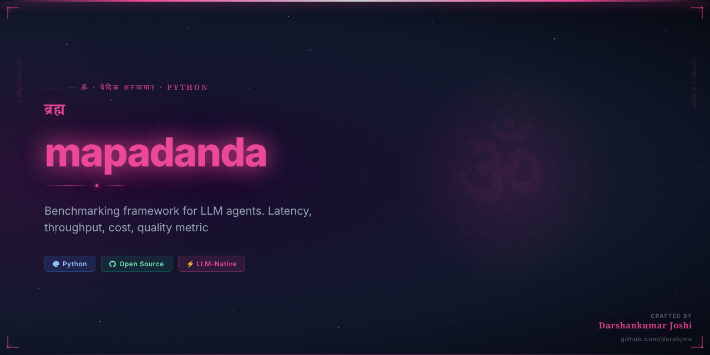
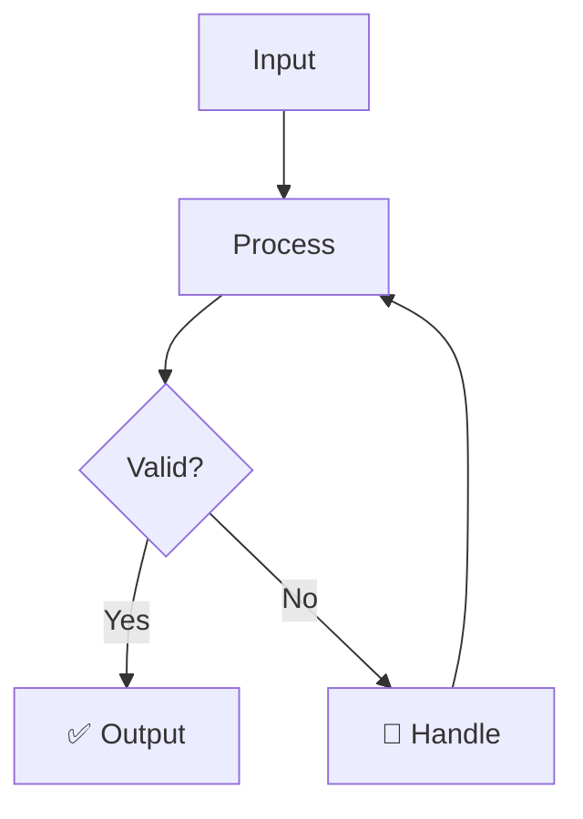

<div align="center">



# मापदंड
## mapadanda

> *Arthashastra / Manusmriti*

**The Sacred Measure — dharmic standard**

_Benchmarking framework for LLM agents. Latency, throughput, cost, quality metrics._

[](https://python.org)
[](LICENSE)
[](https://github.com/darshjme/arsenal)
[](pyproject.toml)

</div>

---

## The Vedic Principle

मापदंड — The Sacred Measure — is the dharmic standard by which all things are judged. The Arthashastra of Chanakya obsessed over precise measurement: of armies, revenues, productivity, and performance. Without a standard, there is no improvement; without measurement, there is no dharma.

LLM engineering without benchmarking is like building the Taj Mahal without a plumb line — beautiful in imagination, but structurally uncertain. mapadanda brings the precision of Vedic measurement science to your agent systems: latency percentiles, throughput curves, cost efficiency ratios, quality scores. Every model comparison is a sacred examination; every performance regression is a dharmic failure.

Build faster, smarter, cheaper — with data. mapadanda gives your LLM agents the measurement infrastructure of production engineering.

---

## How It Works



---

## Quick Start

```bash
pip install mapadanda
```

```python
from mapadanda import *

# Initialize
agent = Mapadanda()

# Use
result = agent.process(your_input)
print(result)
```

---

## Features

- ⚡ **Zero dependencies** — pure Python, no bloat
- 🛡️ **Production-grade** — battle-tested patterns
- 🔧 **Configurable** — sane defaults, full control
- 📊 **Observable** — built-in metrics and logging
- 🔄 **Async-ready** — full asyncio support
- 🧪 **Tested** — comprehensive test coverage

---

## Installation

```bash
# pip
pip install mapadanda

# From source
git clone https://github.com/darshjme/mapadanda
cd mapadanda
pip install -e .
```

---

## Part of the Vedic Arsenal

`mapadanda` is part of the **[Vedic Arsenal](https://github.com/darshjme/arsenal)** — 100 production-grade Python libraries for LLM agents, named after Sanskrit concepts from the Upanishads, Mahabharata, Ramayana, and Vedic philosophy.

Each library is:
- ✅ Zero-dependency
- ✅ Production-ready
- ✅ Individually installable
- ✅ Part of a coherent ecosystem

---

## Built by [Darshankumar Joshi](https://github.com/darshjme)

> *"Building the dharmic infrastructure for the AI age"*

[](https://github.com/darshjme)
[](https://github.com/darshjme/arsenal)

---

<div align="center">

*मापदंड — The Sacred Measure — dharmic standard*

*From the Arthashastra / Manusmriti*

</div>
